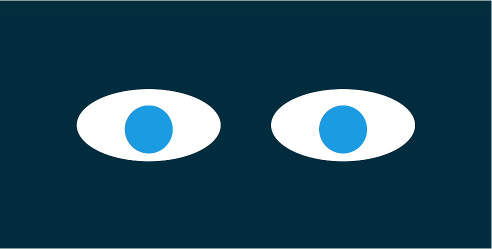

# [Eyes Exercise](https://danilocanuto.github.io/Eyes/)

Description: In this exercise my task was to add and position a second "eye" element and have both eyes follow the mouse position on the screen using mouse events.

I utilized HTML/JS/CSS to create the elements, style them and andd functionality. The JS file contains the onmousemove function which makes the eyes follow the movments of the mouse.

Future Improvements: I'm goinf to work on making the eyes blink.
Installation: Opensourse.

Usage: Practice making objects follow the movements from the mouse. 

Licenced by MIT 'Full Stack Development with MERN program for educational purposes only.

